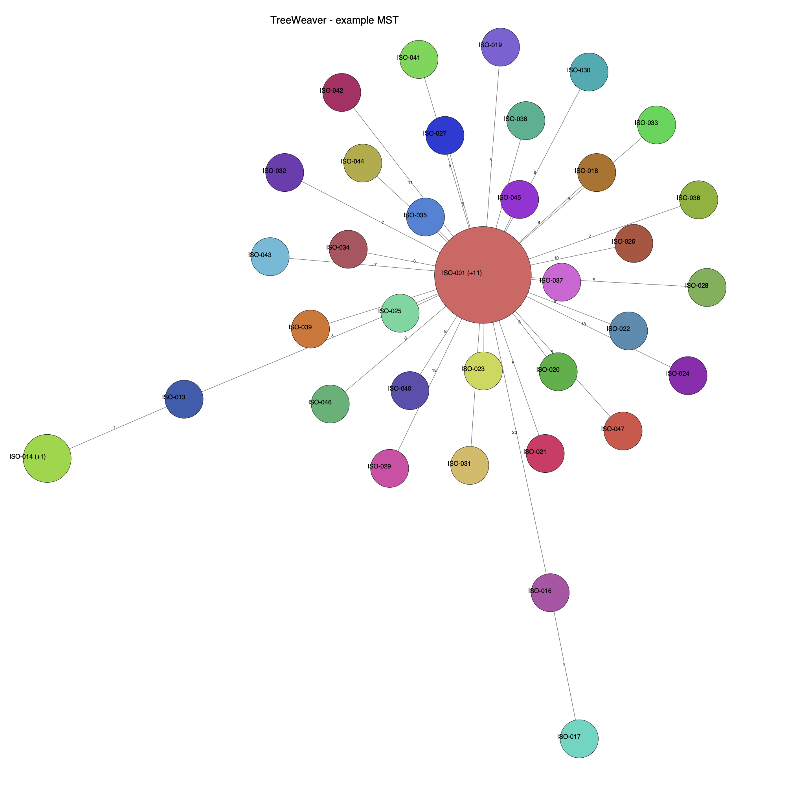

# TreeWeaver

**Interactive minimum spanning trees from any distance matrix — in your browser.**

TreeWeaver is a single-file, dependency-free web app that turns a pairwise distance
matrix (e.g. SNP distances between genomes) into an interactive minimum spanning tree.
Upload a matrix, watch the tree relax into place, tune the layout, and export a
publication-ready figure — all locally, with no server and no data leaving your machine.



*Example: 47 isolates — a 12-sample outbreak core with many offshoots
(see [`examples/example_matrix.tsv`](examples/example_matrix.tsv)).*

---

## Features

- **Upload any distance matrix** (TSV) and build the MST on the fly.
- **Three MST algorithms** — Prim, Kruskal, Boruvka — switchable live.
- **Cluster collapsing** — merge samples within a SNP threshold (0, 1, 2, …) into
  single nodes sized by the number of samples they contain.
- **Four layout modes**:
  - *Spring* — uniform repulsion + SNP-scaled spring rest length.
  - *SNP-weighted repulsion* — repulsion scaled by the SNP distance between nodes.
  - *Stress (MDS)* — Kamada-Kawai stress layout (edge length tracks SNP distance).
  - *Stiff springs* — stronger springs so rest lengths dominate.
- **Live force simulation** with Play/Pause, plus Repulsion / Attraction / Speed sliders.
- **Styling controls** — node-label size, edge-label font size, edge thickness.
- **Export** to **SVG**, **PNG**, and **PDF** (vector), matching exactly what you see.
- **Per-node downloads** — hover a node to download its sample list and its sub-SNP matrix.
- **Fully client-side** — one HTML file, no dependencies, no tracking.

---

## Quick start

### Option 1 — open the file

Download [`index.html`](index.html) and open it in any modern browser. That's it.

### Option 2 — GitHub Pages

The app is served directly from this repository:

```
https://12nucleus.github.io/TreeWeaver/
```

### Option 3 — run locally

```bash
git clone https://github.com/12nucleus/TreeWeaver.git
cd TreeWeaver
open index.html          # macOS
# or: xdg-open index.html   (Linux)  /  start index.html  (Windows)
```

Then click **Matrix**, choose a `.tsv` distance matrix, and the tree is built and
animated automatically.

---

## Input format

A square, symmetric distance matrix in **tab-separated** format:

- the first row is a header: an empty corner cell followed by the sample names;
- the first column repeats the sample names;
- the remaining cells are the pairwise distances (integers or floats);
- the diagonal is zero.

```
	ISO-001	ISO-002	ISO-003
ISO-001	0	8	5
ISO-002	8	0	6
ISO-003	5	6	0
```

A ready-to-use example is provided in
[`examples/example_matrix.tsv`](examples/example_matrix.tsv) — 47 isolates forming a
12-sample outbreak core with many offshoots.

---

## Controls

| Control | What it does |
|---|---|
| **Matrix** | Upload a `.tsv` distance matrix. |
| **▶ Play / ⏸ Pause** | Start/stop the live force simulation. |
| **Reset** | Restore the initial layout. |
| **Export + Download** | Save the current view as SVG, PNG, or PDF. |
| **Zoom + / Zoom − / Fit** | Zoom and re-frame the view. |
| **MST** | Choose Prim, Kruskal, or Boruvka. |
| **Collapse** | Merge samples within 0–10 SNPs into single nodes. |
| **Layout** | Spring, SNP-weighted repulsion, Stress (MDS), or Stiff springs. |
| **Repulsion / Attraction / Speed** | Tune the force simulation. |
| **Label size / Edge font / Edge width** | Style the figure. |

**Mouse:** drag a node to pin and move it · drag the background to pan · scroll to zoom ·
hover a node for details and per-node downloads.

---

## Per-node downloads

Hovering a node shows a tooltip with two buttons:

- **Download samples** — a `.txt` with the sample names in that node (one per line).
- **Download matrix** — a `.tsv` with the sub-SNP matrix for that node's members.

Files are named after the uploaded matrix and the node label, e.g.
`example_matrix_ISO-001_6_samples.txt`.

---

## How it works

1. **MST** — the distance matrix is treated as a complete graph; the minimum spanning
   tree is computed with the selected algorithm (Prim is O(n²), Kruskal sorts all edges,
   Boruvka adds each component's cheapest edge).
2. **Collapse** — samples within the chosen SNP threshold are merged (union-find) into
   super-nodes; edges inside a group are dropped and the minimum edge between groups is kept.
3. **Layout** — a force-directed (or stress) layout positions the nodes; node size grows
   with the square root of the number of samples it represents.
4. **Render** — nodes are drawn as coloured circles, edges are labelled with the SNP
   distance, and everything is interactive.

All of this runs in the browser; the full matrix is embedded in the page (or read from
your uploaded file).

---

## Generating prebuilt pages (optional)

The repository also ships a small Python generator, [`make_mst.py`](make_mst.py), which
can produce a prebuilt page with a matrix already embedded, or the standalone app:

```bash
# standalone app (no embedded matrix)
python3 make_mst.py --app --out-prefix index

# prebuilt page from a matrix
python3 make_mst.py --matrix examples/example_matrix.tsv --out-prefix example --collapse 1
```

It only needs `numpy` and the standard library.

---

## License

[MIT](LICENSE) © 12nucleus
